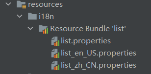
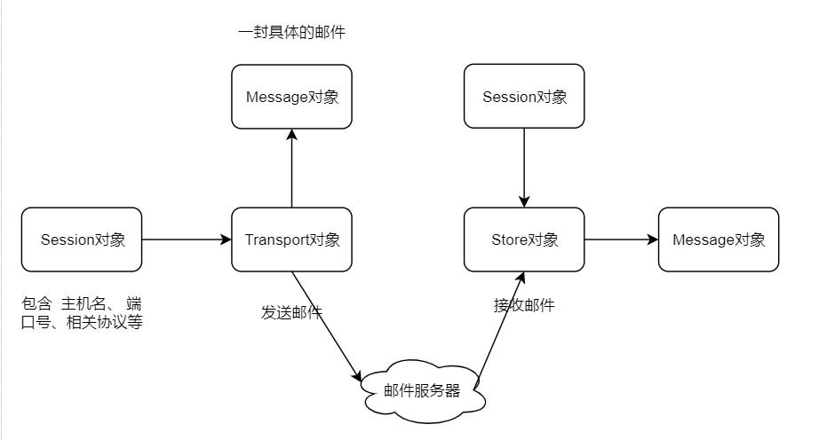

# 通用环境

- 编程语言：Java 1.8
- IDE：intelliJ IDEA
- 数据库：MySQL 8.0
- 版本管理工具：Maven 3.6.3

# 01：ssm在线视频学习网站 - 模拟

- Web容器：Tomcat 9.0.37
- ssm：Spring + SpringMVC + Mybatis 

### 一 : 数据库

1. 课程类型 course_type

   id、类目名称 name、类目状态 flag

2. 课程专题 course_topic

   id、标题 title、课程封面 cover_url、课程简介 intro、简介URL intro_url、课程浏览次数 views、课程状态 flag、**课程分类** course_type_id、创建时间 create_time、VIP会员 vip_flag、课件下载 courseware_url

3. 课程视频 course_video

   id、视频名字 name、是否试看 free_flag、**课程专题ID** course_topic_id、视频状态 flag、创建时间 create_time、视频播放地址1 video_url1、视频播放地址2 video_url2

4. 用户表 user

   id、用户名 name、密码 passsword、电话 number、email、会员状态 vip_flag、注册时间  create_time、状态 flag

5. 工具类型 tool_type

   id、名称 name、状态 flag

6. 工具表 tool_item

   id、名称 name、地址URL tool_url、封面图片 cover_url、**类型ID** tool_type_id、状态 flag

7. 横幅图片 banner

   id、横幅图片URL banner_img_url、状态 flag、类型 type、创建时间 create_time、目标地址 banner_url
   
8. 补充：每个表都有`flag`字段，默认为1，删除为0（这就是假的删除了）

```mysql
# 数据库
CREATE SCHEMA `ssm4` DEFAULT CHARACTER SET utf8 ;

# 课程类型
CREATE TABLE `ssm4`.`course_type` (
  `id` INT NOT NULL AUTO_INCREMENT,
  `name` VARCHAR(255) NULL,
  `flag` TINYINT NULL DEFAULT 1,
  PRIMARY KEY (`id`))
ENGINE = InnoDB
DEFAULT CHARACTER SET = utf8
COLLATE = utf8_bin;

# 课程专题
CREATE TABLE `ssm4`.`course_topic` (
  `id` INT NOT NULL AUTO_INCREMENT,
  `title` VARCHAR(255) NULL,
  `cover_url` VARCHAR(255) NULL,
  `intro` VARCHAR(255) NULL,
  `intro_url` VARCHAR(255) NULL,
  `views` INT NULL,
  `flag` TINYINT NULL DEFAULT 1,
  `course_type_id` INT NULL,
  `create_time` DATETIME NULL,
  `vip_flag` TINYINT NULL,
  `courseware_url` VARCHAR(255) NULL,
  PRIMARY KEY (`id`))
ENGINE = InnoDB
DEFAULT CHARACTER SET = utf8
COLLATE = utf8_bin;

# 课程视频
CREATE TABLE `ssm4`.`course_video` (
  `id` INT NOT NULL AUTO_INCREMENT,
  `name` VARCHAR(255) NULL,
  `free_flag` TINYINT NULL,
  `course_topic_id` INT NULL,
  `flag` TINYINT NULL DEFAULT 1,
  `create_time` DATETIME NULL,
  `video_url1` VARCHAR(255) NULL,
  `video_url2` VARCHAR(255) NULL,
  PRIMARY KEY (`id`))
ENGINE = InnoDB
DEFAULT CHARACTER SET = utf8
COLLATE = utf8_bin;

# 用户
CREATE TABLE `ssm4`.`user` (
  `id` INT NOT NULL AUTO_INCREMENT,
  `name` VARCHAR(255) NULL,
  `password` VARCHAR(255) NULL,
  `number` VARCHAR(255) NULL,
  `email` VARCHAR(255) NULL,
  `vip_flag` TINYINT NULL,
  `create_time` DATETIME NULL,
  `flag` TINYINT NULL DEFAULT 1
  PRIMARY KEY (`id`))
ENGINE = InnoDB
DEFAULT CHARACTER SET = utf8
COLLATE = utf8_bin;

# 工具类型
CREATE TABLE `ssm4`.`tool_type` (
  `id` INT NOT NULL AUTO_INCREMENT,
  `name` VARCHAR(255) NULL,
  `flag` TINYINT NULL DEFAULT 1,
  PRIMARY KEY (`id`))
ENGINE = InnoDB
DEFAULT CHARACTER SET = utf8
COLLATE = utf8_bin;

# 工具
CREATE TABLE `ssm4`.`tool_item` (
  `id` INT NOT NULL AUTO_INCREMENT,
  `name` VARCHAR(255) NULL,
  `tool_url` VARCHAR(255) NULL,
  `cover_url` VARCHAR(255) NULL,
  `tool_type_id` INT NULL,
  `flag` TINYINT NULL DEFAULT 1,
  PRIMARY KEY (`id`))
ENGINE = InnoDB
DEFAULT CHARACTER SET = utf8
COLLATE = utf8_bin;

# 横幅图片
CREATE TABLE `ssm4`.`banner` (
  `id` INT NOT NULL AUTO_INCREMENT,
  `banner_img_url` VARCHAR(255) NULL,
  `flag` TINYINT NULL DEFAULT 1,
  `type` INT NULL COMMENT '广告图分类，区分展示页面',
  `create_time` DATETIME NULL,
  `banner_url` VARCHAR(255) NULL,
  PRIMARY KEY (`id`))
ENGINE = InnoDB
DEFAULT CHARACTER SET = utf8
COLLATE = utf8_bin;
```

### 二、前端页面

**1、头页面**

- 注册

  > 正则、验证码、ajax验证

- 登录

  > ajax验证、自动登录、忘记密码

- 自动登录

  > 使用token记录自动登录状态，保存用户登录状态48小时（2天）；关闭浏览器，下次打开浏览器，如果没有超过时间，仍然是登录状态
  >
  > token不能保存在session中，因为浏览器关闭session结束了；正常实现（Redis）或者保存在全局的数据 application
  
    浏览器（cookie）
    token = xxxxxxxxxxxxxxxxxxxxxxxxx (登录凭证，48小时失效)
  
    服务器（）
    1 登录成功，返回token给浏览器保存，自动登录凭证。
    2 token生成：时间、用户、IP、浏览器信息、（MD5）
  
    用户打开浏览器
    1 token发送到服务器
    2 服务器根据token获取对应的值，
    3 验证token是否有效：时间、用户、IP、浏览器信息、（MD5）

- 恢复用户登录

  > 拦截器，判断token是否有效（时间、用户、IP、浏览器信息）+ 时间是否超时
  >
  > 如果有效，直接session放入user，变成已登录
  >
  > 如果失效，什么都不做

- 忘记密码（email找回密码）

  1. 跳转找回密码页面
  2. 填写用户email、验证码，点击发送邮件（修改密码链接）
     - 实际路径：http://www.duyi.com?m=xxxxxxxxxxx&u=email&t=xxx
     - 路径混淆：http://www.duyi.com?token=xxxxxxxxxxx，token=（m=xxxxxxxxxxx&u=email）base64混淆
  3. 打开邮箱，访问链接
  4. 服务器接处理URL（修改密码链接），
     - 验证URL是否合法（时间是否超时，是否是服务器生成，是否有篡改）
     - 跳转修改密码页面
     - 输入密码，提交密码修改用户密码

# 02：springboot-epidemic - 模拟

在数据可视化方面，涉及到 表格、折线图、柱状图、中国地图

前三者都需要分别设计一个bean，但只设计了前两者的数据库，第三个我偷懒了...

## 一、数据库

```mysql
CREATE SCHEMA `epidemic` DEFAULT CHARACTER SET utf8 ;
```

**表格**

id、地区名 name、现有确诊人数 now_confirm、累计确诊人数 confirm、死亡人数 dead、治愈人数 heal

```mysql
CREATE TABLE `epidemic`.`illness` (
  `id` BIGINT NOT NULL AUTO_INCREMENT,
  `name` VARCHAR(255) NULL,
  `now_confirm` INT NULL,
  `confirm` INT NULL,
  `dead` INT NULL,
  `heal` INT NULL,
  PRIMARY KEY (`id`))
ENGINE = InnoDB
DEFAULT CHARACTER SET = utf8;
```

**折线图**

```mysql
CREATE TABLE `epidemic`.`graph` (
  `id` bigint NOT NULL AUTO_INCREMENT,
  `date` varchar(45) COLLATE utf8_estonian_ci DEFAULT NULL,
  `confirm` int DEFAULT NULL,
  `heal` int DEFAULT NULL,
  `dead` int DEFAULT NULL,
  PRIMARY KEY (`id`)
) ENGINE=InnoDB AUTO_INCREMENT=1344578936000938121 DEFAULT CHARSET=utf8 COLLATE=utf8_estonian_ci
```

## 二、爬虫

> 搜索引擎做的事儿，链接人和内容

爬虫： 网页爬取 -- 网页去重 -- 网页解析  -- 内容保存（倒排索引）

- 通用型爬虫——非定向数据 （搜索引擎使用）
- 垂直型爬虫——定向数据（本项目使用）

**爬取数据 新型冠状病毒肺炎 - 疫情实时追踪**

1. 爬取对象：腾讯新闻 https://news.qq.com/zt2020/page/feiyan.htm#/
   1. 疫情数据的请求地址 https://view.inews.qq.com/g2/getOnsInfo?name=disease_h5
   2. 数据格式 JSON
2. 爬取对象：丁香医生 https://ncov.dxy.cn/ncovh5/view/pneumonia
   1. 疫情数据的请求地址 https://ncov.dxy.cn/ncovh5/view/pneumonia
   2. 数据格式 HTML

## 三、爬取数据并存储

**持久层框架使用 mybats-plus**

1. pom.xml 引入依赖
2. apllication.yml 数据库配置(url driver-class username password)
3. mapper接口 `extends BaseMapper<DataBean>`
4. 主程序入口增加注解 `@MapperScan("com.zgh.mapper")`
5. service 
   1. 接口`extends IService<DataBean>`
   2. 子类实现 `extends ServiceImpl<DataMapper, DataBean>`
6. bean 
   1. 序列化 `implements Serializable`
   2. 使用 lombok `@@Data @AllArgsConstructor @NoArgsConstructor`
   3. 对应数据库中具体的表 `@TableName("illness")`

**初始化数据**

1. 定义一个类 > 爬取疫情数据 > 每一份数据都封装到 bean 中 > 全部 bean 存储在集合中

2. 让其在服务器启动时执行 将数据存储入数据库中 方法上加上`@PostConstruct` 

   服务器启动流程：服务器加载 Servlet > Servlet 执行构造函数 > PostConstruct >   init > service > destroy > PreDestroy > 服务器卸载 Servlet

**定时更新数据**

1. 主程序入口增加注解 `@EnableScheduling`
2. 在更新方法中设置定时时效 `@Scheduled(cron = "0 0/10 * * * ?")` 每十分钟执行一次

cron 表达式（有七个字段：秒 分 时 日 月 周 年）

| 字段 |   范围    |
| :--: | :-------: |
|  秒  |   0-59    |
| 分钟 |   0-59    |
| 小时 |   0-23    |
| 日期 |   1-31    |
| 月份 |   1-12    |
| 星期 |    1-7    |
| 年份 | 2013-3000 |

字符：`*`任意  `-`区间  `,`枚举  `/`步长  `L`最后   `W`工作日

 `@Scheduled`

1）cron 表达式

`@Scheduled(cron = "0 0/10 * * * ?")` 每十分钟执行一次

2）固定频率任务

 `@Scheduled(fixedRate = 10000)` 每10s执行一次

从上一次方法执行开始的时间算起，如果上一次方法阻塞住了，下一次并不会执行，但是在阻塞这段时间内累计应该执行的次数，当不再阻塞时，一下子把这些全部执行掉，而后再按照固定速率继续执行

3）固定间隔任务

 `@Scheduled(fixedDelay = 10000)` 每10s执行一次

以上一次方法执行完开始算起，如果上一次方法执行阻塞住了，那么直到上一次执行完，并间隔给定的时间后，执行下一次

## 四、数据可视化

**表格** 展示国内各省疫情情况 现有确诊人数 now_confirm、累计确诊人数 confirm、死亡人数 dead、治愈人数 heal

使用 **echarts** 实现数据可视化

- **折线图** 自疫情爆发以来国内每日 累计确诊人数 confirm、死亡人数 dead、治愈人数 heal

- **柱状图** 省市境外输入TOP10

- **中国地图** 现有确诊 + 累计确诊

## 五、国际化

**切换多语种**

- list.properties 声明 key 和 value，默认显示的数据（注意编码格式）

- list_zh_CN.properties 和 list_en_US.properties，分别对应中文与英文（美国）

  

- application.yml，增加 `spring.messages.basename=i18n.list`（list代表默认使用的文件名）

- 浏览器鉴别语言的原理是，根据 http 请求中 Accept-Language 参数的不同，然后进行语言切换处理

## 六、邮件发送



使用电子邮件协议 SMTP = Simple Mail Transfer Protocol 简单邮件传输协议

## 七、多页面合并